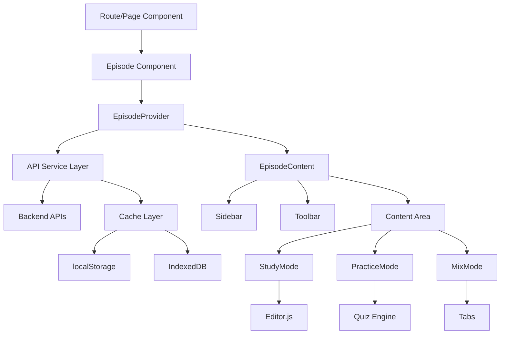

# API Integration Guide for FFURBIO Episode Module

## 🎯 Overview

This guide documents all API integration points in the Episode module and provides a roadmap for connecting the prototype to backend services.

## 📊 Current State

The Episode module is currently a **functional prototype** using:
- Local state management with React Context
- Sample data from static files
- localStorage for persistence
- Simulated API delays for realistic UX

## 🔌 API Integration Points

### 1. Episode Data Loading

**Location**: `src/components/Episode/Episode.tsx`

```typescript
// Current (Prototype)
const fetchEpisodeData = async (id: string) => {
  // Using sample data
  setTreeData(sampleTreeData)
  setQuestions(sampleQuestions)
}

// Future (API Integration)
const fetchEpisodeData = async (id: string) => {
  const [episodeData, treeData, questionsData] = await Promise.all([
    episodeService.getEpisodeMetadata(id),
    episodeService.getEpisodeTree(id),
    episodeService.getQuizQuestions(id, 'all')
  ])
  
  setTreeData(treeData)
  setQuestions(questionsData)
  setContent(episodeData.content)
}
```

### 2. Content Auto-Save

**Location**: `src/components/Episode/Episode.tsx`

```typescript
// Current (Prototype)
const saveContent = async (content: string) => {
  console.log('[Episode] Content saved')
}

// Future (API Integration)
const saveContent = async (content: string) => {
  await episodeService.saveStudyContent(
    episodeId,
    state.activeSpoint,
    content
  )
}
```

### 3. Progress Tracking

**Location**: `src/components/Episode/context/EpisodeContext.tsx`

```typescript
// Current (Prototype)
addCompletedSpoint: (id: string) => {
  // Only updates local state
}

// Future (API Integration)
addCompletedSpoint: async (id: string) => {
  // Optimistic update
  setState(prev => ({...prev, completedSpoints: new Set([...prev.completedSpoints, id])}))
  
  // Sync with backend
  try {
    await episodeService.markSpointComplete(episodeId, id, true)
  } catch (error) {
    // Rollback on failure
    setState(prev => {
      const updated = new Set(prev.completedSpoints)
      updated.delete(id)
      return {...prev, completedSpoints: updated}
    })
  }
}
```

### 4. Quiz Results

**Location**: `src/components/Episode/Episode.tsx`

```typescript
// Current (Prototype)
const handleQuizComplete = (score: number) => {
  console.log('Quiz completed:', score)
}

// Future (API Integration)
const handleQuizComplete = async (score: number) => {
  const result = await episodeService.submitQuizResults(episodeId, {
    questions,
    answers: quizAnswers,
    score,
    duration: quizDuration
  })
  
  // Update leaderboard, achievements, etc.
  updateUserStats(result)
}
```

## 🔄 Data Flow Architecture



## 📝 API Endpoints Required

### Episode Management

| Endpoint | Method | Description | Request | Response |
|----------|--------|-------------|---------|----------|
| `/api/episodes/{id}` | GET | Get episode metadata | - | `EpisodeMetadata` |
| `/api/episodes/{id}/tree` | GET | Get episode structure | - | `TreeNode[]` |
| `/api/episodes/{id}/content` | GET | Get study content | `?spointId` | `StudyContent` |
| `/api/episodes/{id}/content` | PUT | Save study content | `StudyContent` | `Success` |

### Progress Tracking

| Endpoint | Method | Description | Request | Response |
|----------|--------|-------------|---------|----------|
| `/api/episodes/{id}/progress` | GET | Get user progress | - | `ProgressData` |
| `/api/episodes/{id}/spoints/{spointId}/complete` | POST | Mark spoint complete | `{completed: boolean}` | `Success` |
| `/api/episodes/{id}/progress/sync` | POST | Sync all progress | `ProgressData` | `Success` |

### Quiz Management

| Endpoint | Method | Description | Request | Response |
|----------|--------|-------------|---------|----------|
| `/api/episodes/{id}/quiz/questions` | GET | Get quiz questions | `?type&count` | `QuizQuestion[]` |
| `/api/episodes/{id}/quiz/generate` | POST | Generate questions | `{content, type, count}` | `QuizQuestion[]` |
| `/api/episodes/{id}/quiz/submit` | POST | Submit quiz results | `QuizSubmission` | `QuizResult` |
| `/api/episodes/{id}/quiz/stats` | GET | Get quiz statistics | - | `QuizStats` |

### Real-time Features

| Endpoint | Method | Description | Protocol |
|----------|--------|-------------|----------|
| `/ws/episodes/{id}` | WS | Real-time collaboration | WebSocket |
| `/ws/episodes/{id}/presence` | WS | User presence tracking | WebSocket |
| `/ws/episodes/{id}/cursors` | WS | Cursor positions | WebSocket |

## 🚀 Implementation Phases

### Phase 1: Basic Integration (Week 1-2)
- [ ] Connect to authentication service
- [ ] Implement episode loading
- [ ] Basic progress tracking
- [ ] Simple content saving

### Phase 2: Advanced Features (Week 3-4)
- [ ] Quiz generation API
- [ ] Leaderboard integration
- [ ] Analytics tracking
- [ ] Batch operations

### Phase 3: Real-time Features (Week 5-6)
- [ ] WebSocket connection
- [ ] Collaborative editing
- [ ] Live presence indicators
- [ ] Real-time notifications

### Phase 4: Optimization (Week 7-8)
- [ ] Response caching
- [ ] Offline support
- [ ] Background sync
- [ ] Performance monitoring

## 🔐 Security Considerations

### Authentication
```typescript
// Add auth token to all requests
apiClient.addRequestInterceptor((config) => {
  const token = getAuthToken()
  if (token) {
    config.headers['Authorization'] = `Bearer ${token}`
  }
  return config
})
```

### Data Validation
```typescript
// Validate API responses
const validateEpisodeData = (data: unknown): EpisodeData => {
  const schema = z.object({
    id: z.string(),
    title: z.string(),
    content: z.string(),
    // ... other fields
  })
  
  return schema.parse(data)
}
```

### Rate Limiting
```typescript
// Implement client-side rate limiting
const rateLimiter = new RateLimiter({
  maxRequests: 100,
  windowMs: 60000 // 1 minute
})

apiClient.addRequestInterceptor(async (config) => {
  await rateLimiter.wait()
  return config
})
```

## 🔧 Development Setup

### Mock API Server

Create a mock server for development:

```javascript
// mock-server.js
const express = require('express')
const app = express()

app.get('/api/episodes/:id', (req, res) => {
  res.json({
    id: req.params.id,
    title: 'Sample Episode',
    description: 'Learning content'
  })
})

app.listen(3001, () => {
  console.log('Mock API server running on port 3001')
})
```

### Environment Variables

```env
# .env.development
REACT_APP_API_URL=http://localhost:3001/api
REACT_APP_WS_URL=ws://localhost:3001/ws
REACT_APP_USE_MOCK_API=true

# .env.production
REACT_APP_API_URL=https://api.ffurbio.com
REACT_APP_WS_URL=wss://api.ffurbio.com/ws
REACT_APP_USE_MOCK_API=false
```

## 📊 Monitoring & Analytics

### Performance Tracking
```typescript
// Track API performance
apiClient.addResponseInterceptor((response) => {
  const duration = Date.now() - response.config.startTime
  analytics.track('api_request', {
    endpoint: response.config.url,
    duration,
    status: response.status
  })
  return response
})
```

### Error Tracking
```typescript
// Send errors to monitoring service
apiClient.addErrorInterceptor((error) => {
  Sentry.captureException(error, {
    tags: {
      component: 'Episode',
      api_endpoint: error.config?.url
    }
  })
})
```

## 🧪 Testing Strategy

### Unit Tests
```typescript
describe('Episode API Integration', () => {
  it('should load episode data', async () => {
    const mockData = { id: '123', title: 'Test' }
    mockApiClient.get.mockResolvedValue({ data: mockData })
    
    const result = await episodeService.getEpisodeMetadata('123')
    expect(result).toEqual(mockData)
  })
})
```

### Integration Tests
```typescript
describe('Episode E2E', () => {
  it('should save and restore progress', async () => {
    // Complete a spoint
    await page.click('[data-testid="spoint-complete"]')
    
    // Refresh page
    await page.reload()
    
    // Check progress is preserved
    const completed = await page.$('[data-testid="spoint-completed"]')
    expect(completed).toBeTruthy()
  })
})
```

## 📚 Resources

- [API Documentation](https://docs.ffurbio.com/api)
- [WebSocket Protocol](https://docs.ffurbio.com/websocket)
- [Authentication Guide](https://docs.ffurbio.com/auth)
- [Error Codes Reference](https://docs.ffurbio.com/errors)

## 🤝 Team Contacts

- **Backend Team**: backend@ffurbio.com
- **DevOps**: devops@ffurbio.com
- **Security**: security@ffurbio.com

---

Last Updated: [Current Date]
Version: 1.0.0